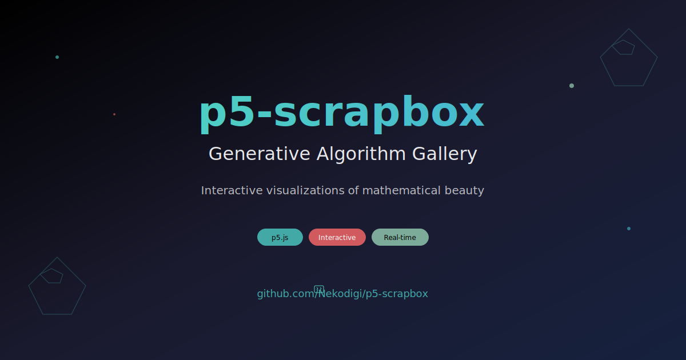

# p5-scrapbox

<div align="center">
  
  
  [](https://nekodigi.github.io/p5-scrapbox/)
  [](LICENSE)
  [](https://p5js.org/)
</div>

## 🎨 Overview

p5-scrapbox is an interactive gallery showcasing the beauty of generative algorithms and mathematical visualizations. Explore over 50 unique artworks across 9 categories, each demonstrating different aspects of creative coding with p5.js.

**[🚀 Live Demo](https://nekodigi.github.io/p5-scrapbox/)**

## ✨ Features

- **50+ Interactive Artworks**: From particle systems to fractals, physics simulations to cellular automata
- **9 Categories**: Organized collection covering various algorithmic art domains
- **Real-time Interaction**: Mouse, keyboard, and touch controls for each artwork
- **Fullscreen Mode**: Immersive viewing experience for each piece
- **Search & Filter**: Easily find artworks by name or category
- **Favorites System**: Save your favorite pieces locally
- **Responsive Design**: Works beautifully on desktop and mobile devices
- **Dark Theme**: Eye-friendly viewing experience

## 🎯 Categories

### 🌟 Particles
Dynamic particle systems including gravity wells, fireworks, magnetic fields, swarm intelligence, and flow fields.

### 🔺 Fractals
Mathematical beauty through Mandelbrot sets, Julia sets, Dragon curves, Sierpinski triangles, and L-systems.

### 🌊 Waves & Audio
Visualizations of wave interference, Lissajous curves, cymatics, and Fourier series.

### 🦠 Cellular Automata
Conway's Game of Life, elementary CA, Langton's Ant, reaction-diffusion, and Particle Lenia.

### ⚡ Physics
Real-world physics simulations including cloth, fluids, springs, orbital mechanics, and chaotic pendulums.

### 🎲 Generative
Procedural landscapes, abstract compositions, Voronoi diagrams, recursive trees, and noise-based paintings.

### 🎮 3D
Three-dimensional visualizations with particle clouds, torus knots, terrain generation, and 3D fractals.

### 🎯 Interactive
Engaging experiences like color matching, maze generation, pattern memory, and physics sandboxes.

### 🧮 Algorithms
Visualization of computer science concepts including shortest path algorithms.

## 🚀 Getting Started

### Prerequisites

- Modern web browser with JavaScript enabled
- No installation required - runs entirely in the browser!

### Running Locally

1. Clone the repository:
```bash
git clone https://github.com/Nekodigi/p5-scrapbox.git
cd p5-scrapbox
```

2. Serve the files using any HTTP server:
```bash
# Using Python
python -m http.server 8000

# Using Node.js
npx http-server

# Or open index.html directly in your browser
```

3. Navigate to `http://localhost:8000` in your browser

## 🛠️ Technical Stack

- **p5.js 1.7.0**: Creative coding library for canvas rendering
- **Vanilla JavaScript**: No framework dependencies
- **CSS3**: Modern styling with CSS Grid and Flexbox
- **LocalStorage**: For favorites persistence

## 📁 Project Structure

```
p5-scrapbox/
├── index.html              # Main entry point
├── manifest.json           # PWA manifest
├── favicon.svg             # Vector favicon
├── scripts/
│   ├── app.js              # Main application logic
│   ├── gallery.js          # Gallery system
│   ├── p5-background.js    # Background animation
│   └── sketches/           # Individual artwork files
│       ├── particles/      # Particle system artworks
│       ├── fractals/       # Fractal artworks
│       ├── waves/          # Wave visualizations
│       ├── cellular/       # Cellular automata
│       ├── physics/        # Physics simulations
│       ├── generative/     # Generative art
│       ├── 3d/             # 3D visualizations
│       ├── interactive/    # Interactive pieces
│       └── algorithms/     # Algorithm visualizations
├── styles/
│   ├── main.css            # Main styles
│   ├── work.css            # Individual work page styles
│   └── enhancements.css    # UI enhancements
├── works/                  # Individual HTML pages for each artwork
└── assets/                 # Images and other assets
```

## 🎮 Controls

Most artworks support various interaction methods:

- **Mouse**: Click, drag, and hover interactions
- **Keyboard**: Arrow keys, spacebar, and letter keys for different controls
- **Touch**: Full touch support for mobile devices
- **UI Controls**: Reset button, pause/play, and artwork-specific sliders

## 🤝 Contributing

Contributions are welcome! Feel free to:

1. Fork the repository
2. Create a feature branch (`git checkout -b feature/NewArtwork`)
3. Add your generative artwork to the appropriate category
4. Update `gallery.js` with your artwork metadata
5. Submit a pull request

### Adding New Artwork

1. Create your p5.js sketch in `scripts/sketches/[category]/`
2. Add the artwork entry to `gallery.js`
3. Create a thumbnail (the system can auto-generate one)
4. Test locally before submitting

## 📝 License

This project is open source and available under the [MIT License](LICENSE).

## 🙏 Acknowledgments

- [p5.js](https://p5js.org/) community for the amazing creative coding library
- All contributors who have added their creative algorithms
- The generative art community for continuous inspiration

## 📧 Contact

- **GitHub**: [@Nekodigi](https://github.com/Nekodigi)
- **YouTube**: [@Nekodigi](https://www.youtube.com/@Nekodigi)

---

<div align="center">
  Made with ❤️ and p5.js
</div>